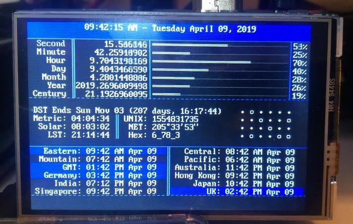

# Raspberry Pi Chronometer

Turn your RaspberryPi in to a [Chronometer](https://www.reddit.com/r/raspberry_pi/comments/bb8ddc/made_a_rpi_desk_clock_as_a_means_of_learning/).

Display is a [UCTRONICS 3.5 Inch HDMI display](https://www.amazon.com/gp/product/B076M399XX).

### Notes:

In order to get the display to work with this code, you need to set the resolution to 480x320, and set the console font to VGA 8x14.
NTP daemon needs to be running as a background service: `sudo apt install ntp`

### Required Python modules:

* `ephem`
* `pytz`
* `ntplib`

Modules can be install using `pip install [module]` or from your distros repositories.
