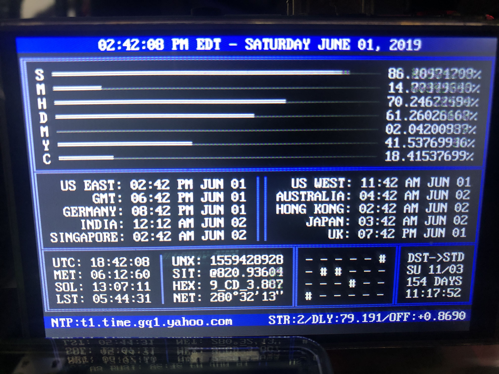

# Raspberry Pi Chronometer



Turn your RaspberryPi in to an [Internet Chronometer](https://www.reddit.com/r/raspberry_pi/comments/bb8ddc/made_a_rpi_desk_clock_as_a_means_of_learning/).

Display is a [UCTRONICS 3.5 Inch HDMI display](https://www.amazon.com/gp/product/B076M399XX).

### Features:

+ Utilizes system time via NTP.  All you need to provide is an internet connection.
+ Customizable world clock timezones

## Description / Abbreviations
+ TOP
    * Completion chart for current time units ([S]econd, [M]inute, [H]our, [D]ay, [M]onth, [Y]ear, [C]entury).
+ MIDDLE
    * Left: World Clock
    * Right:
        * LS - Leap Shift - Current time offset that has to be corrected by the [leap cycle](https://en.wikipedia.org/wiki/Leap_year)
        * SR - Sunrise Timer
        * SS - Sunset Timer
        * DD - Daylight Duration
+ BOTTOM
    * Left: Time Systems
        * UTC - [Coordinated Universal Time](https://en.wikipedia.org/wiki/Coordinated_Universal_Time)
        * MET - [Metric Time](https://en.wikipedia.org/wiki/Metric_time)
        * SOL - [Solar Time](https://en.wikipedia.org/wiki/Solar_time)
        * LST - [Local Sidereal Time](https://en.wikipedia.org/wiki/Sidereal_time)
        * UNX - [Unix Epoch Time](https://en.wikipedia.org/wiki/Unix_time)
        * SIT - [Swatch Internet Time](https://en.wikipedia.org/wiki/Swatch_Internet_Time)
        * NET - [New Earth Time](https://en.wikipedia.org/wiki/New_Earth_Time)
        * HEX - [Hexadecimal Time](https://en.wikipedia.org/wiki/Hexadecimal_time)
        * [Binary Clock](https://en.wikipedia.org/wiki/Binary_clock)
    * Right: Calendar Systems
        * IFC - [International Fixed Calendar](https://en.wikipedia.org/wiki/International_Fixed_Calendar)
        * TWC - [The World Calendar](https://en.wikipedia.org/wiki/World_Calendar)
        * AND - [Annus Novus Decimal Calendar](http://www.atlantium.org/calendaran.html)
        * RJD - [Reduced Julian Date](https://en.wikipedia.org/wiki/Julian_day)
    * [NTP](https://en.wikipedia.org/wiki/Network_Time_Protocol) Status (Server, Stratum, Delay, Offset)


## Requirements

* In order to get the HDMI display to work with this code, you need to set the resolution to 480x320 and set the console font to VGA 8x14.
* NTP daemon needs to be running as a background service: `sudo apt install ntp`
* Python3 (Should already be installed on RPi): `sudo apt install python3`
* `pytz` module for python3: `pip3 install pytz` or from your distros repositories.

## Installation for Raspberry Pi
1. Download the script to a folder of your choice.
    ```
    curl -O https://raw.githubusercontent.com/rothman857/chronometer/master/chronometer.py
    ```
2. Running chronometer.py for the first time will generate a .config file with default values*:
    ```
    python3 <path/to/chronometer.py>
    ```
3. Edit .config with current coordinates in decimal notation (West longitude is negative)
    ```
    "coordinates": {
      "latitude": 40.7128,
      "longitude": -74.006
    },
    ```
4. Update time zones as desired.  Timezones must be in pytz format.  To see a list of available options, run the following in a python3 shell:
    ```
    import pytz
    for tz in pytz.all_timezones:
        print(tz)
    ```
5. If you wish to have the chronometer start at boot, add the following line to /etc/rc.local (before the `exit(0)` line):
    ```
    python3 /path/to/chronometer.py &

    ...
    exit(0)
    ```
    
### Notes
* *Sunrise, sunset, daylight duration, and solar time were calculated from the [Sunrise Equation](https://en.wikipedia.org/wiki/Sunrise_equation), which uses the coordinates provided in .config.  Using the default values for longitude and latitude may result in inaccurate calculations.